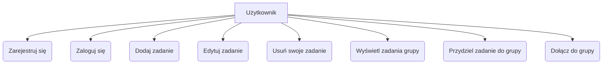
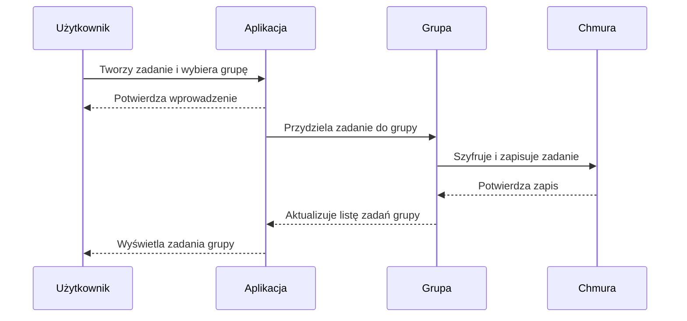
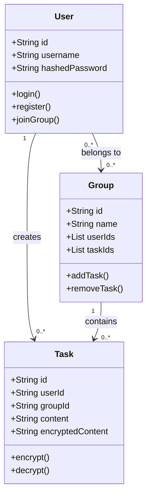
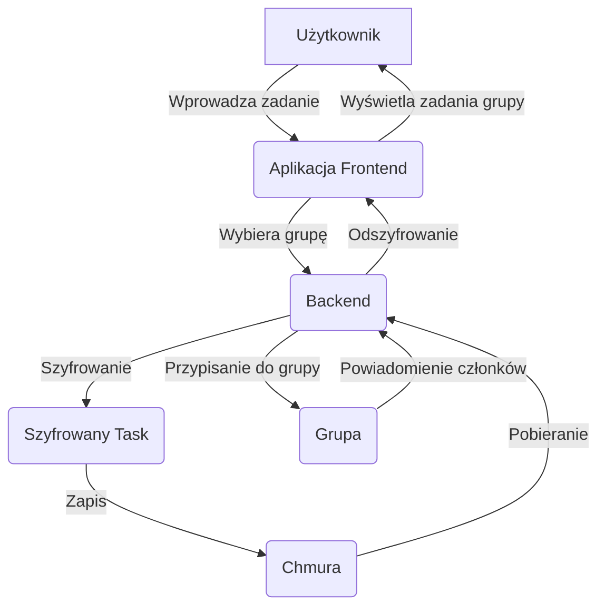

# TO DO LIST AZURE

## Diagram Aktorów (Use Case Diagram)


```mermaid    
    J[Administrator] --> K(Zarządzaj użytkownikami)
    J --> L(Usuń dowolne zadanie)
    J --> M(Wyświetl wszystkich użytkowników)
    J --> N(Blokuj/Odblokuj użytkownika)
    J --> O(Zarządzaj grupami)
```

## Diagram Sekwencji



## Diagram Klas



## Diagram Przepływu



