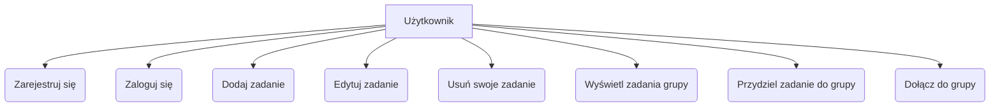
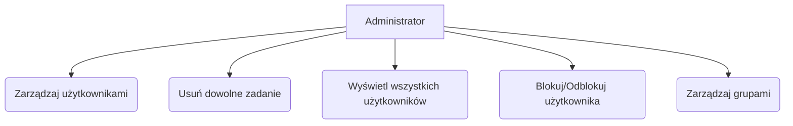
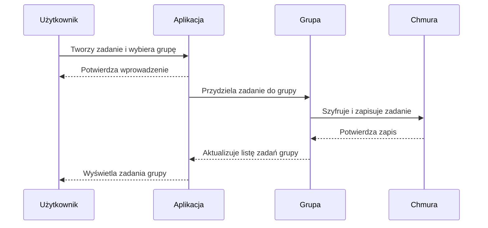
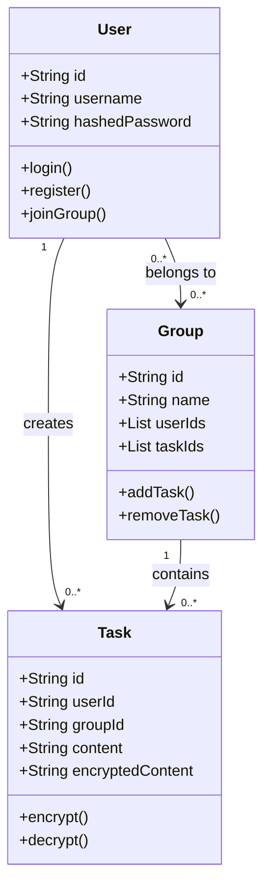
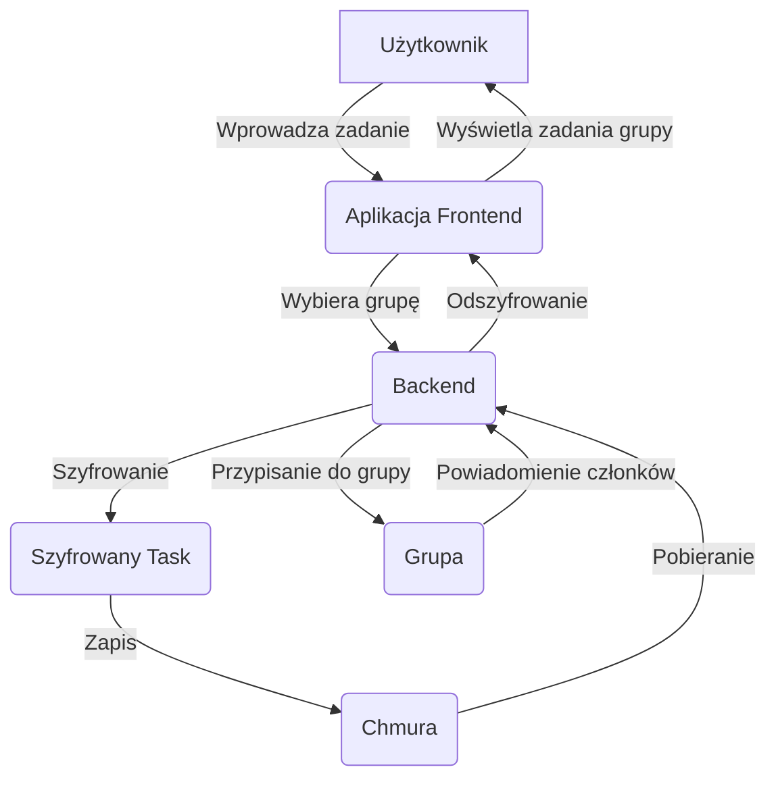

# TO DO LIST AZURE

## Opis projektu
**To Do List Azure** to prosta aplikacja do zarządzania zadaniami w grupach, inspirowana uproszczoną wersją Trello, stworzona w ramach przedmiotu "Bezpieczeństwo usług chmurowych". Użytkownicy mogą tworzyć zadania, przydzielać je do grup oraz współpracować z innymi członkami grupy w bezpieczny sposób. Aplikacja została zaprojektowana z naciskiem na bezpieczeństwo danych w chmurze, wykorzystując platformę Microsoft Azure jako środowisko wdrożeniowe. Projekt łączy praktyczne elementy programowania (Express.js, Node.js) z zaawansowanymi mechanizmami zabezpieczeń, takimi jak szyfrowanie, kontrola dostępu i monitorowanie w chmurze.

Celem projektu jest nie tylko stworzenie funkcjonalnej aplikacji, ale także demonstracja kluczowych zasad bezpieczeństwa usług chmurowych, takich jak ochrona danych w spoczynku i tranzycie, zarządzanie tożsamością, ochrona API oraz reagowanie na potencjalne zagrożenia.

---

## Skład zespołu
- **Karolina Dekajło** – projektowanie i implementacja frontendu
- **Katarzyna Dudek** – projektowanie diagramów, implementacja backendu i zabezpieczeń
- **Maja Wiśniewska** – konfiguracja usług Azure i monitorowanie
- **Jakub Czabok** – testy bezpieczeństwa i dokumentacja

---

## Diagramy

### Diagram Aktorów (Use Case Diagram)
Diagram przedstawia aktorów (Użytkownik i Administrator) oraz ich interakcje z systemem. Dla czytelności podzielono go na dwa osobne fragmenty.

#### Użytkownik

**Opis:** Użytkownik może rejestrować się, logować, zarządzać swoimi zadaniami oraz współpracować z grupami.

#### Administrator

**Opis:** Administrator ma dodatkowe uprawnienia do zarządzania użytkownikami i grupami, co pozwala na pełną kontrolę nad systemem.

---

### Diagram Sekwencji (Sequence Diagram)

**Opis:** Diagram pokazuje proces tworzenia zadania i jego synchronizacji z grupą w chmurze, z uwzględnieniem szyfrowania danych przed zapisem.

---

### Diagram Klas (Class Diagram)

**Opis:** Model danych aplikacji obejmuje trzy główne klasy: `User` (użytkownik), `Task` (zadanie) i `Group` (grupa), z relacjami wskazującymi na możliwość tworzenia zadań i przynależność do grup.

---

### Diagram Przepływu Danych (Data Flow Diagram)

**Opis:** Diagram ilustruje przepływ danych od użytkownika przez frontend i backend, z szyfrowaniem i zapisem w chmurze, aż do wyświetlenia zadań członkom grupy.

---

## Architektura aplikacji
Aplikacja jest oparta na następujących komponentach:
1. **Frontend:** Statyczna aplikacja (np. React) hostowana w Azure Blob Storage.
2. **Backend:** Express.js w kontenerze Docker uruchomionym na Azure App Service lub Azure Container Instances.
3. **Baza danych:** MongoDB hostowane w Azure Cosmos DB z włączonym szyfrowaniem.
4. **API Gateway:** Azure API Management do zabezpieczenia i monitorowania API.
5. **Zarządzanie kluczami:** Azure Key Vault do przechowywania kluczy szyfrujących i tajemnic.
6. **Monitorowanie:** Azure Monitor i Application Insights do logów i analizy bezpieczeństwa.

---

## Struktura projektu
```
project/
├── models/           # Modele danych
│   ├── user.js
│   ├── task.js
│   └── group.js
├── routes/           # Trasy API
│   ├── auth.js      # Rejestracja i logowanie
│   ├── tasks.js     # Zarządzanie zadaniami
│   └── groups.js    # Zarządzanie grupami
├── middleware/       # Middleware
│   └── auth.js      # Autoryzacja JWT
├── config/           # Konfiguracja
│   └── db.js        # Połączenie z Cosmos DB
├── utils/            # Narzędzia
│   └── crypto.js    # Szyfrowanie/deszyfrowanie
├── app.js            # Główny plik aplikacji
├── Dockerfile        # Definicja kontenera
├── package.json      # Zależności
└── .env              # Zmienne środowiskowe (nie w repo)
```

---

## Wymagania instalacyjne
### Zależności
- Node.js (v16+)
- npm
- Docker (opcjonalnie, dla konteneryzacji)
- Konto Azure z dostępem do Cosmos DB, Key Vault, API Management i App Service

### Instalacja
1. Sklonuj repozytorium:
   ```bash
   git clone <repo-url>
   cd project
   ```
2. Zainstaluj zależności:
   ```bash
   npm install
   ```
3. Skonfiguruj zmienne środowiskowe w pliku `.env` (patrz sekcja poniżej).
4. Uruchom aplikację lokalnie:
   ```bash
   npm run dev
   ```

---

## Konfiguracja środowiska (`.env`)
```plaintext
PORT=3000
MONGO_URI=<twoje-cosmos-db-connection-string>
JWT_SECRET=<tajny-klucz-jwt>
ENCRYPTION_KEY=<32-bajtowy-klucz-hex-dla-aes-256>
FRONTEND_URL=http://localhost:3001
AZURE_KEY_VAULT_URI=<uri-key-vault>
```

---

## Mechanizmy bezpieczeństwa
Aplikacja została zaprojektowana z myślą o bezpieczeństwie usług chmurowych. Poniżej opisano wdrożone mechanizmy i pomysły edukacyjne:

### 1. Uwierzytelnianie i autoryzacja
- **JWT:** Tokeny z krótkim czasem ważności (15 minut) i refresh tokeny przechowywane w Azure Key Vault.
- **MFA:** Możliwość integracji z Azure Active Directory B2C dla wieloskładnikowego uwierzytelniania.
- **RBAC:** Role dla użytkowników i administratorów z kontrolą доступа na poziomie Cosmos DB.

### 2. Szyfrowanie danych
- **W spoczynku:** Treść zadań szyfrowana za pomocą AES-256, klucze w Azure Key Vault.
- **W tranzycie:** TLS 1.3 wymuszony na poziomie Azure API Management.
- **Edukacja:** Porównanie szyfrowania po stronie klienta i serwera.

### 3. Kontrola dostępu
- **Azure IAM:** Polityki ograniczające dostęp do Cosmos DB i Key Vault tylko dla backendu.
- **Least Privilege:** Minimalne uprawnienia dla każdego komponentu.

### 4. Ochrona API
- **Azure API Management:** Rate limiting i WAF do blokowania ataków typu SQL Injection.
- **Walidacja:** Biblioteka Joi w Expressie do sprawdzania danych wejściowych.

### 5. Monitorowanie
- **Azure Monitor:** Logowanie wszystkich żądań i błędów.
- **Application Insights:** Analiza anomalii i alerty w czasie rzeczywistym.
- **Edukacja:** Symulacja ataku brute-force i reakcja systemu.

### 6. Bezpieczne wdrożenie
- **Docker:** Minimalne obrazy skanowane pod kątem podatności.
- **CI/CD:** Azure DevOps z automatycznym skanowaniem kodu.

### 7. Ochrona przed DDoS
- **Azure Front Door:** CDN i ochrona przed atakami DDoS.
- **Auto-scaling:** App Service skalowany w odpowiedzi na ruch.

### 8. Backup
- **Cosmos DB:** Automatyczne snapshoty z replikacją w innym regionie Azure.

---

## Przykładowe użycie API
### Rejestracja
```bash
curl -X POST http://localhost:3000/api/auth/register \
-H "Content-Type: application/json" \
-d '{"username": "user1", "password": "pass123"}'
```

### Tworzenie zadania
```bash
curl -X POST http://localhost:3000/api/tasks \
-H "Authorization: Bearer <jwt-token>" \
-H "Content-Type: application/json" \
-d '{"content": "Nowe zadanie", "groupId": "<group-id>"}'
```

---

## Testy bezpieczeństwa
1. **SQL Injection:** Spróbuj wstrzyknąć złośliwy kod w polu `content`.
2. **Token Replay:** Użyj przechwyconego JWT po wygaśnięciu.
3. **DDoS:** Symulacja za pomocą narzędzia Locust.

---

## Wdrożenie w Azure
1. **Frontend:** Wgraj pliki do Azure Blob Storage i skonfiguruj statyczną stronę.
2. **Backend:** Wdróż kontener Docker na Azure App Service.
3. **Baza danych:** Skonfiguruj Cosmos DB z szyfrowaniem.
4. **API:** Ustaw Azure API Management z politykami bezpieczeństwa.
5. **Klucze:** Skonfiguruj Key Vault i podłącz do backendu.

---

## Uwagi końcowe
Projekt "To Do List Azure" to nie tylko aplikacja, ale także platforma do nauki bezpieczeństwa w chmurze. Dzięki modularnej strukturze i integracji z Azure można go łatwo rozszerzać o nowe funkcjonalności i testy. Zachęcamy do eksperymentowania z konfiguracją i symulacjami ataków, aby lepiej zrozumieć zasady ochrony usług chmurowych.
